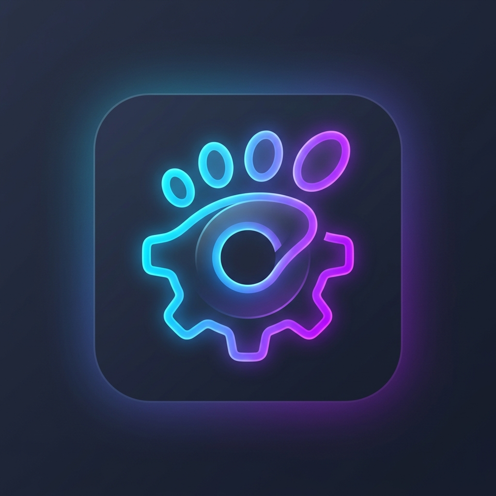
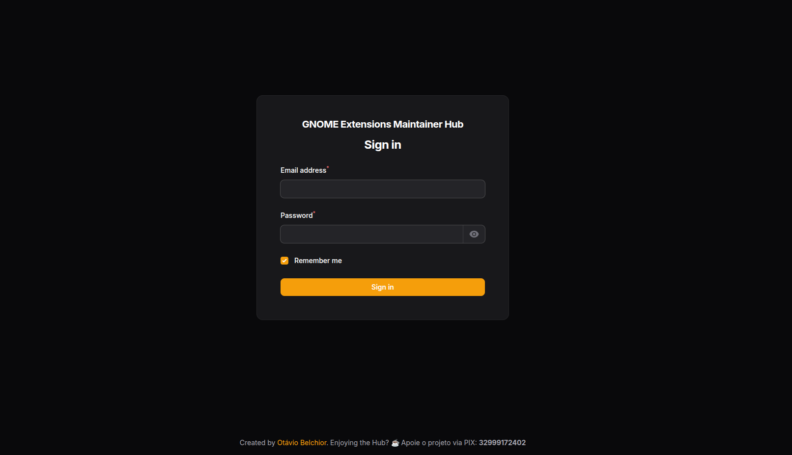
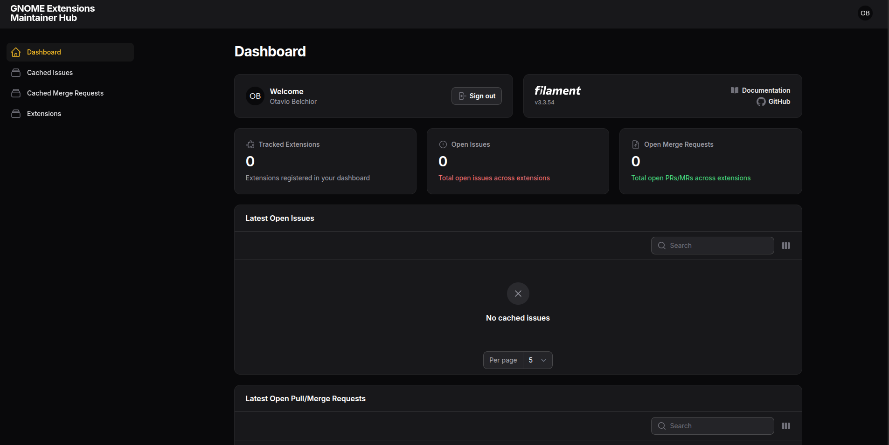
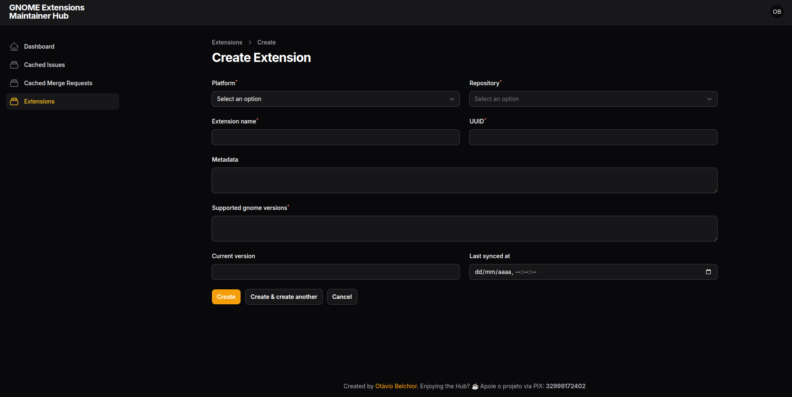

<p align="center">
  
</p>

# GNOME Extensions Maintainer Hub

Created by [Otávio Belchior](https://github.com/OtavioAVBelchior)

The GNOME Extensions Maintainer Hub is a comprehensive dashboard built with Laravel and Filament, designed specifically for GNOME Shell Extension developers. It centralizes your workflow by automatically syncing and tracking open issues and merge/pull requests across GitHub and GitLab for all your extensions.

## Features

- **GitHub & GitLab Integration:** Log in securely via OAuth and automatically fetch your repositories.
- **Centralized Dashboard:** View total tracked extensions, open issues, and open merge requests in one place.
- **Multi-tenant Architecture:** Data is isolated per user, meaning you only see the extensions and issues you track.
- **Automated Sync:** A scheduled command keeps your extension data synced with their remote Git providers.
- **Elegant Admin Panel:** Powered by Filament, providing a beautiful and responsive user interface out of the box.

## Requirements

- PHP 8.2 or higher
- Composer
- SQLite (or any other database supported by Laravel)
- GitHub / GitLab OAuth Application credentials

## Installation

1. **Clone the repository:**
   ```bash
   git clone https://github.com/your-username/gnome-extensions-hub.git
   cd gnome-extensions-hub
   ```

2. **Install PHP dependencies:**
   ```bash
   composer install
   ```

3. **Set up environment variables:**
   ```bash
   cp .env.example .env
   ```
   Generate the application key:
   ```bash
   php artisan key:generate
   ```

4. **Configure Database & OAuth:**
   Open `.env` and set up your SQLite database (or another driver):
   ```env
   DB_CONNECTION=sqlite
   ```
   Then, add your GitHub OAuth credentials:
   ```env
   GITHUB_CLIENT_ID="your-github-client-id"
   GITHUB_CLIENT_SECRET="your-github-client-secret"
   ```
   *(To get these, go to GitHub > Settings > Developer Settings > OAuth Apps. Set the callback URL to `http://127.0.0.1:8000/auth/github/callback`)*

5. **Run Migrations:**
   ```bash
   php artisan migrate
   ```

6. **Serve the Application:**
   ```bash
   php artisan serve
   ```
   Visit `http://127.0.0.1:8000/` and click **Login with GitHub**.

7. **Run the Scheduler:**
   To keep issues and PRs automatically synced, run the Laravel queue/scheduler worker:
   ```bash
   php artisan schedule:work
   ```
   Or run the sync command manually:
   ```bash
   php artisan extensions:sync
   ```

## How to Use

*(Feel free to add your own screenshots below each section!)*

### 1. Dashboard Overview
Once logged in, the **Dashboard** is your command center. It provides a quick summary of your active extensions, total open issues, and pending merge requests across all tracked repositories. 





### 2. Adding an Extension
To start tracking a repository:
1. Navigate to the **Extensions** menu on the left sidebar.
2. Click **New Extension**.
3. Select your provider (**GitHub** or **GitLab**). 
4. The **Repository** dropdown will automatically fetch and list all your projects using your OAuth token. Select the extension you want to track.
5. Fill in any extra metadata and click **Create**.



### 3. Managing Issues & Pull Requests
The Hub automatically syncs your data in the background (if the scheduler is running). You can view all imported data in the **Cached Issues** and **Cached Merge Requests** pages. 
- Use the table filters to sort by repository, author, or state.
- Quickly identify which PRs need your review without manually checking multiple repositories.

*(Screenshot de Issues/PRs será adicionada em breve)*

## Support the Project! ☕

If you found this tool helpful for maintaining your GNOME extensions and want to buy me a coffee, you can do it via PIX or Buy Me A Coffee!

<a href="https://www.buymeacoffee.com/otavioavbelchior" target="_blank"></a>

**PIX Key:** `32999172402`

Your support is greatly appreciated and helps keep this project alive! ❤️

## License

This project is open-sourced software licensed under the [MIT license](https://opensource.org/licenses/MIT).
